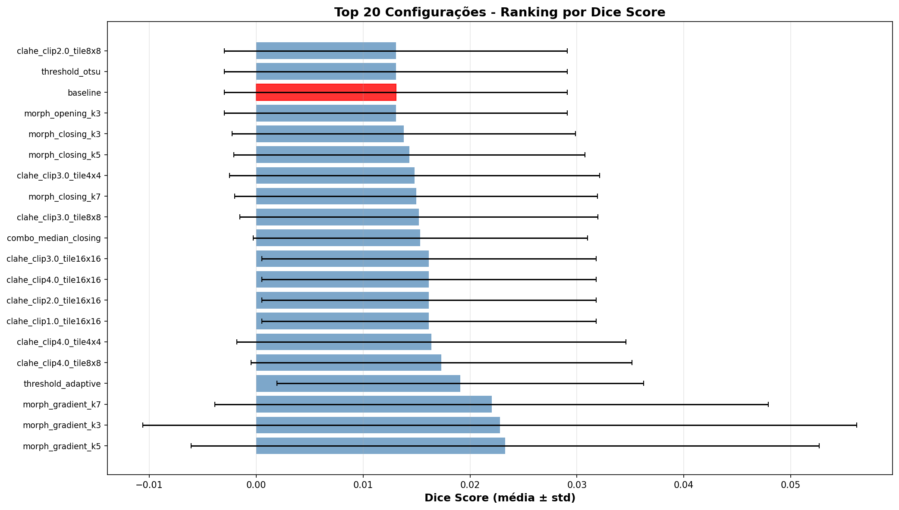
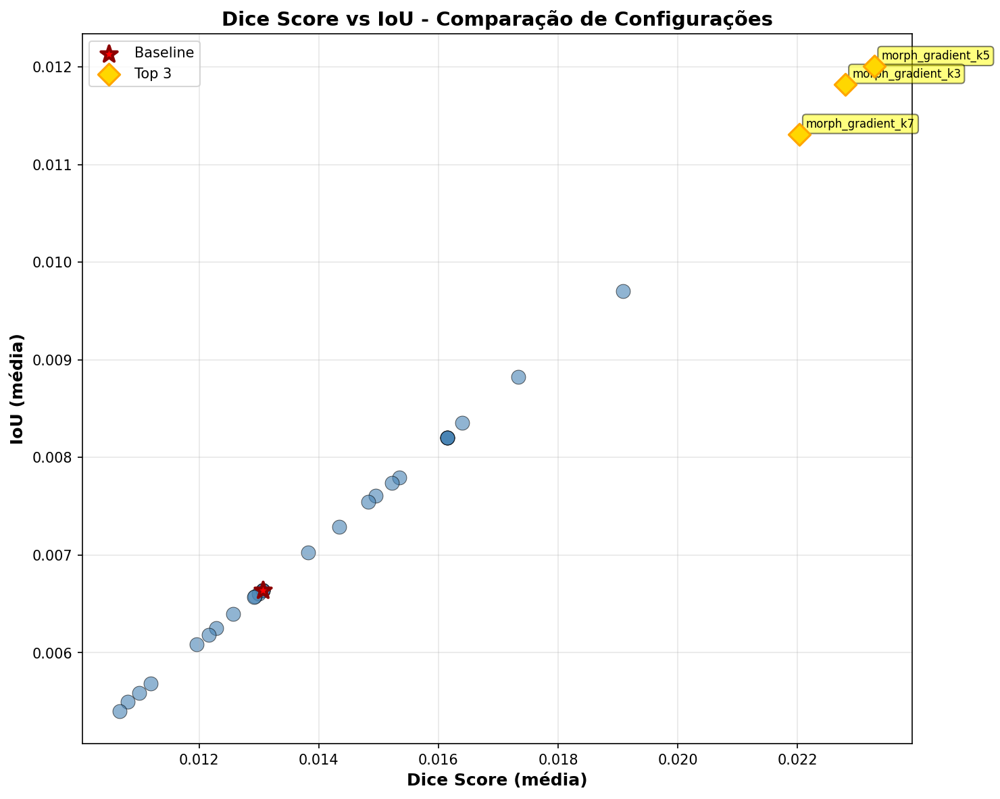
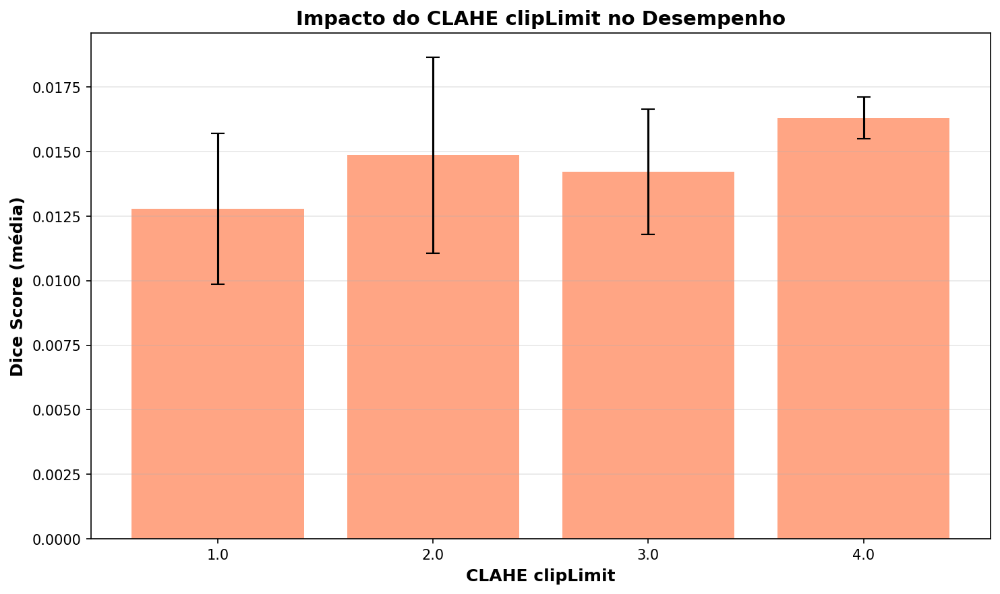
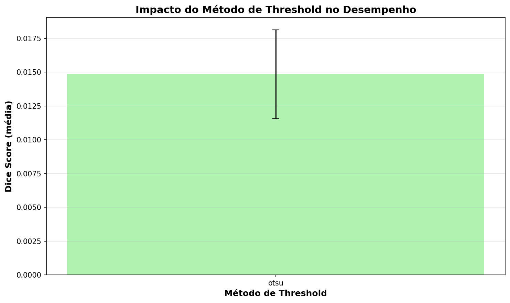
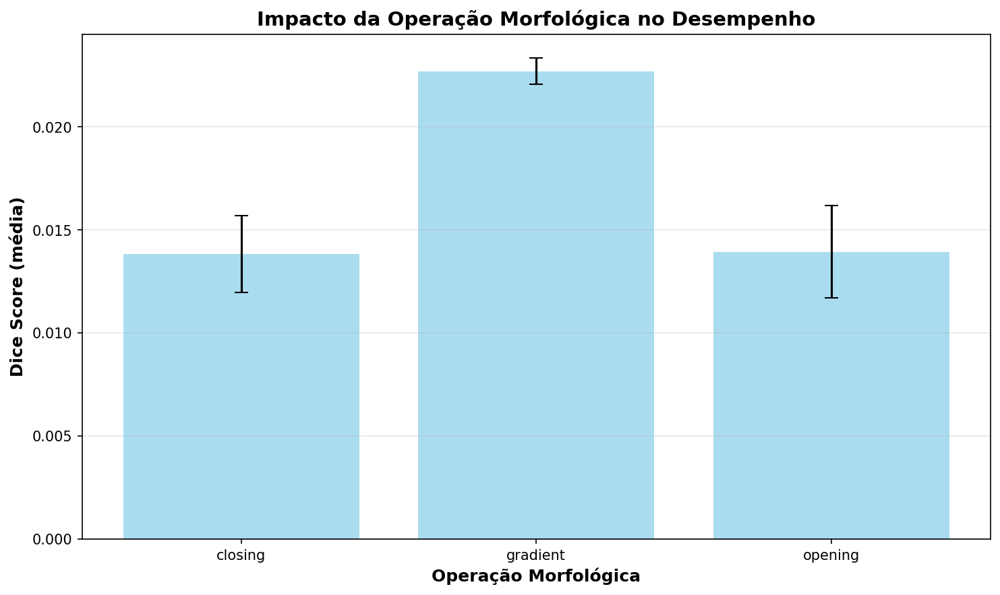
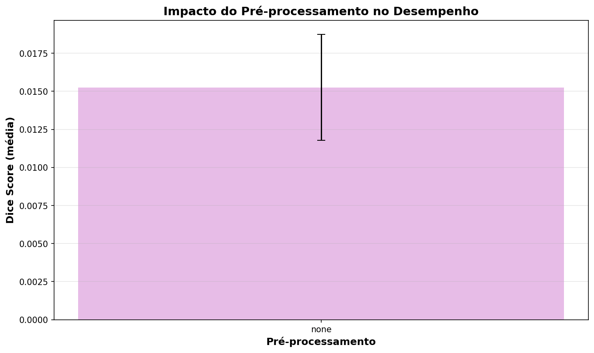

# PulmoSeg - Relatório de Otimização de Parâmetros

**Data de Geração**: 2025-11-19 00:36:37

---

## Sumário Executivo

Este relatório apresenta os resultados de **31 configurações** testadas para otimizar o pipeline de segmentação de nódulos pulmonares PulmoSeg.

- **Baseline (Configuração Original)**: Dice = 0.0131
- **Melhor Configuração**: morph_gradient_k5
  - Dice Score: 0.0233 ± 0.0294
  - IoU: 0.0120 ± 0.0155
  - **Melhoria**: +78.26%

- **Total de Slices Processadas**: 3,565

---

## Metodologia

### Amostragem

- **Seleção de Pacientes**: Amostragem aleatória com seed fixa (seed=42) para reprodutibilidade
- **Critério de Inclusão**: Nódulos com pelo menos 2 máscaras válidas de radiologistas
- **Ground Truth**: Consenso de maioria (≥2 radiologistas concordam)

### Parâmetros Testados

Foram testadas combinações de:

1. **CLAHE (Contrast Limited Adaptive Histogram Equalization)**
   - clipLimit: [1.0, 2.0, 3.0, 4.0]
   - tileGridSize: [(4,4), (8,8), (16,16)]

2. **Pré-processamento**
   - None (sem filtro)
   - Gaussian Blur
   - Median Filter
   - Bilateral Filter

3. **Métodos de Threshold**
   - Otsu (automático)
   - Adaptive Threshold
   - Binary Threshold (fixo)

4. **Operações Morfológicas**
   - Abertura (Opening)
   - Fechamento (Closing)
   - Gradiente Morfológico
   - Tamanhos de kernel: [3x3, 5x5, 7x7]

### Métricas de Avaliação

- **Dice Coefficient**: Mede sobreposição entre predição e ground truth
- **IoU (Intersection over Union)**: Métrica de similaridade geométrica

---

## Resultados

### Top 10 Configurações

| Rank | Configuração | Dice Score | IoU | Slices |
|------|--------------|------------|-----|--------|
| 1 | morph_gradient_k5 | 0.0233 ± 0.0294 | 0.0120 ± 0.0155 | 115 |
| 2 | morph_gradient_k3 | 0.0228 ± 0.0334 | 0.0118 ± 0.0176 | 115 |
| 3 | morph_gradient_k7 | 0.0220 ± 0.0259 | 0.0113 ± 0.0136 | 115 |
| 4 | threshold_adaptive | 0.0191 ± 0.0171 | 0.0097 ± 0.0088 | 115 |
| 5 | clahe_clip4.0_tile8x8 | 0.0173 ± 0.0178 | 0.0088 ± 0.0092 | 115 |
| 6 | clahe_clip4.0_tile4x4 | 0.0164 ± 0.0182 | 0.0084 ± 0.0094 | 115 |
| 7 | clahe_clip1.0_tile16x16 | 0.0161 ± 0.0156 | 0.0082 ± 0.0080 | 115 |
| 8 | clahe_clip2.0_tile16x16 | 0.0161 ± 0.0156 | 0.0082 ± 0.0080 | 115 |
| 9 | clahe_clip4.0_tile16x16 | 0.0161 ± 0.0156 | 0.0082 ± 0.0080 | 115 |
| 10 | clahe_clip3.0_tile16x16 | 0.0161 ± 0.0156 | 0.0082 ± 0.0080 | 115 |

### Estatísticas Gerais

- **Dice Score Médio (todas configs)**: 0.0148
- **Dice Score Mediano**: 0.0080
- **Melhor Dice**: 0.0233
- **Pior Dice**: 0.0107
- **Range**: 0.0126

### Visualizações

#### Ranking de Configurações



*Figura 1: Top 20 configurações rankeadas por Dice Score. Baseline em vermelho para referência.*

#### Dice vs IoU



*Figura 2: Correlação entre Dice Score e IoU. Top 3 destacados em dourado, baseline em vermelho.*

---

## Análise de Impacto dos Parâmetros

### CLAHE clipLimit

**Melhor valor**: 4.0 (Dice médio: 0.0163)



### Método de Threshold

**Melhor método**: otsu (Dice médio: 0.0148)



### Operação Morfológica

**Melhor operação**: gradient (Dice médio: 0.0227)



### Pré-processamento

**Melhor método**: none (Dice médio: 0.0153)



---

## Configuração Recomendada

### morph_gradient_k5

**Parâmetros:**

```json
{
  "name": "morph_gradient_k5",
  "clip_limit": 2.0,
  "tile_grid_size": [
    8,
    8
  ],
  "preprocessing": null,
  "preprocessing_kernel": 5,
  "threshold_method": "otsu",
  "binary_threshold": 127,
  "morph_operation": "gradient",
  "morph_kernel_size": 5,
  "morph_iterations": 1
}
```

**Desempenho:**

- Dice Score: **0.0233** ± 0.0294
- IoU: **0.0120** ± 0.0155
- Slices processadas: 115

---

## Conclusões e Recomendações

1. **Melhoria Significativa**: A otimização de parâmetros resultou em **+78.26%** de melhoria no Dice Score em relação à configuração baseline.

2. **Limitações das Técnicas Clássicas**: Mesmo otimizado, o pipeline clássico (CLAHE + Otsu + Morfologia) apresenta limitações inerentes para segmentação de nódulos pulmonares, especialmente em casos de baixo contraste ou presença de múltiplas estruturas.

3. **Próximos Passos Sugeridos**:
   - Implementar abordagens de Deep Learning (U-Net, Mask R-CNN)
   - Explorar métodos híbridos (clássico + DL)
   - Aumentar tamanho da amostra para validação robusta
   - Testar em dados externos (generalização)

---

## Arquivos Gerados

- `results/comparison_summary.csv` - Resumo comparativo de todas configurações
- `results/best_config.json` - Melhor configuração em formato JSON
- `results/test_runs/*.csv` - Resultados detalhados por configuração
- `results/visualizations/` - Casos extremos (best/worst) por configuração
- `results/analysis/` - Gráficos e análises

---

*Relatório gerado automaticamente por PulmoSeg Report Generator*
